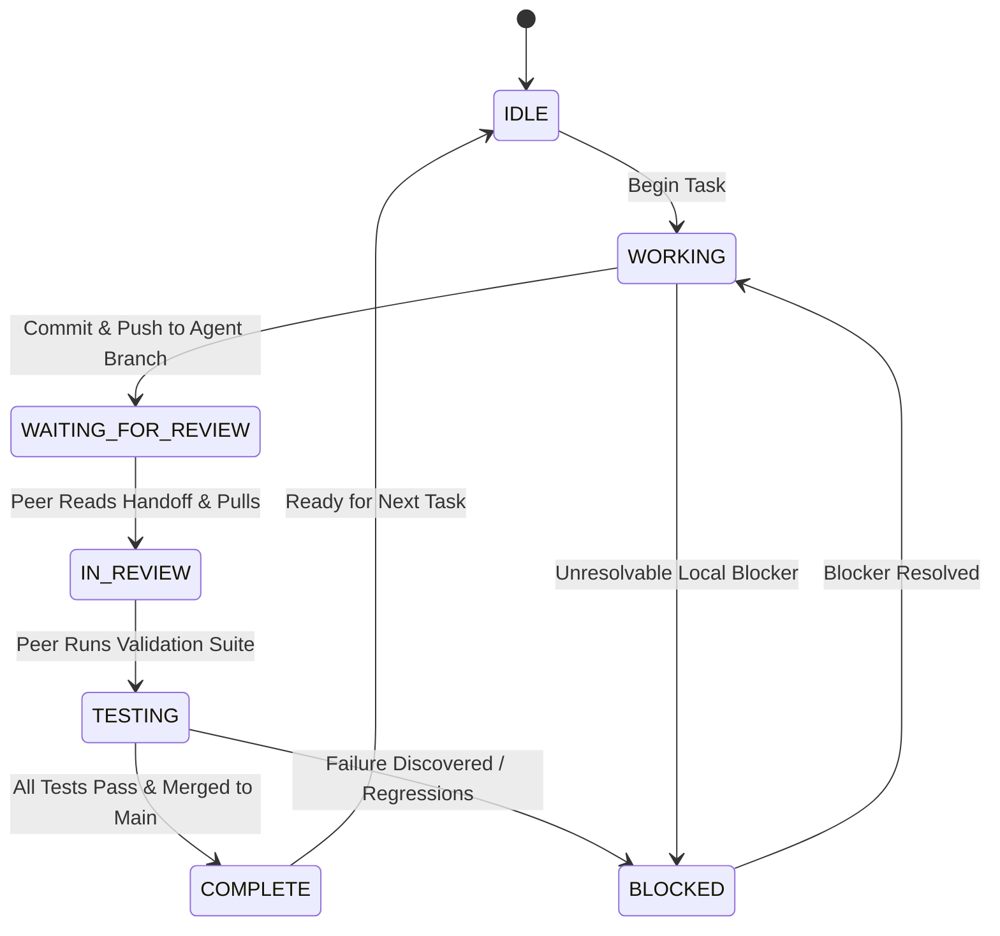

# PipeJack Two-Agent Collaboration Protocol & Coordination Contract

**Document Owner**: VM-2 (Security / CI Integration Lead) & VM-1 (Developer / QA Lead)  
**Established Baseline**: `222a8436eae2fe6b7cbd4f239c26e7adc12314e9`  
**Shared Remote**: `sync-bare` (`/home/ubuntu/pipejack.git` / `ssh://ubuntu@192.168.88.133/home/ubuntu/pipejack.git`)  
**Scope**: Development, testing, integration, and release governance across VM-1 and VM-2.

---

## 1. Overview & Objective

This document defines the strict, repeatable collaboration protocol between two autonomous agents operating in separate virtual machine environments:
- **VM-1 Agent**: Developer / QA Lead
- **VM-2 Agent**: Security / CI / Integration Lead

The primary goal is to prevent race conditions, merge conflicts, lost commits, false-positive test validations, and simultaneous conflicting edits while facilitating continuous development and adversarial validation of the PipeJack Security Platform.

---

## 2. Agent Responsibilities & Component Ownership

```
┌────────────────────────────────────────────────────────┐
│                   VM-1: DEVELOPER / QA                 │
│  Owns:                                                 │
│  - Application source trees (Java, Node.js, Python)    │
│  - Supply-chain attack payloads & malicious packages   │
│  - Attack scenario scripts (attacks/01-07, run-all.sh) │
│  - Client-side test runners & packaging scripts        │
│  - docs/VM1_HANDOFF.md & docs/agent-vm1-state.md       │
└──────────────────────────────────┬─────────────────────┘
                                   │
                    HTTP Upload    │ Git Branch: agent/vm1
                    POST /upload   │ (Pushed to sync-bare)
                                   ▼
┌────────────────────────────────────────────────────────┐
│                 VM-2: SECURITY / CI LEAD               │
│  Owns:                                                 │
│  - PipeJack engine (pipejackd, proctree, fs, netmon)   │
│  - Custom CI server (custom-ci, attest, verify-attest) │
│  - Security policies (policy-*.yaml)                   │
│  - Anomaly baseline database & Ed25519 attestations    │
│  - Systemd services, iptables firewall & Docker images │
│  - Integration validation, reviews & merges to main    │
│  - docs/VM2_HANDOFF.md & docs/agent-vm2-state.md       │
└────────────────────────────────────────────────────────┘
```

### A. VM-1 Responsibilities (Developer / QA)
1. **Application Codebases**: Owns clean client applications (`banking-api`, `nodejs-app`, `python-app`).
2. **Adversarial Scenarios & Payloads**: Owns attack fixtures (`evil-pkg`, `nodejs-malicious`, `python-malicious`) and the attack library (`attacks/01-shell-exec` through `attacks/07-anomaly`, plus runner scripts).
3. **Packaging & Client Execution**: Builds `.tar.gz` archives, triggers CI builds via `curl -F "file=@<tarball>" http://192.168.88.133:8888/upload`, and verifies client-side outcomes.
4. **Developer-Side State Tracking**: Exclusively maintains `docs/agent-vm1-state.md` and `docs/VM1_HANDOFF.md`.
5. **Boundaries**: VM-1 **MUST NOT** directly modify PipeJack engine source (`pipejack/`), CI server daemon (`custom-ci/`), security policies (`policy-*.yaml`), systemd services, or host firewall configurations on VM-2.

### B. VM-2 Responsibilities (Security / CI / Integration Lead)
1. **Core Security Engine**: Owns `pipejack/cmd/pipejackd`, `pipejack/internal/pdp`, `pipejack/internal/proctree`, `pipejack/internal/netmon`, `pipejack/internal/egressfw`, `pipejack/internal/anomaly`, and `pipejack/fschecker`.
2. **CI Server & Orchestration**: Owns `custom-ci/main.go`, `custom-ci/attest.go`, `custom-ci/verify-attest.go`, and `custom-ci/deploy.sh`.
3. **Policy Specifications**: Authoritative over all YAML policies (`policy-banking.yaml`, `policy-node.yaml`, `policy-python.yaml`, `policy-spring.yaml`).
4. **Attestation & Baseline Storage**: Owns cryptographic attestation ledger (`/home/ubuntu/pipejack-attestations/`), signing keys (`/home/ubuntu/.pipejack/attest-key`), and rolling anomaly baselines (`/home/ubuntu/pipejack-baseline/`).
5. **Runtime Deployment**: Owns host systemd services (`pipejack-ci.service`), container images (`pipejack-daemon:latest`, registry containers), and iptables runtime configuration.
6. **Integration Governance**: Responsible for code review, integration testing, merging VM-1 changes into `main`, and releasing verified integration baselines.
7. **Security State Tracking**: Exclusively maintains `docs/agent-vm2-state.md` and `docs/VM2_HANDOFF.md`.
8. **Boundaries**: VM-2 **MUST NOT** alter test payloads, falsify sensor output, or suppress legitimate security findings.

---

## 3. Shared Repository Topology

1. **Primary Shared Remote (`sync-bare`)**:
   - Location: `/home/ubuntu/pipejack.git` (hosted bare Git repository on VM-2).
   - Access from VM-1: `ssh://ubuntu@192.168.88.133/home/ubuntu/pipejack.git` via Ed25519 SSH keys.
   - Access from VM-2: `/home/ubuntu/pipejack.git` or remote alias `sync-bare`.
   - Purpose: Authoritative, private, peer-to-peer synchronization channel. Zero cloud or public repository dependency.
2. **Upstream Remote (`origin`)**:
   - Location: `https://github.com/ramKarthik57/pipejack-test.git`.
   - Purpose: External read-only mirror. Synchronized to GitHub only after changes are verified on `main`.

---

## 4. Branching & Lifecycle Policy

To prevent merge collision and ensure continuous baseline stability, direct development on `main` is strictly prohibited.

```
       [ main ]  (Verified Integration Baseline)
          │
          ├───────────────────────────────┐
          │                               │
          ▼                               ▼
    [ agent/vm1 ]                   [ agent/vm2 ]
  VM-1 Feature/Attack             VM-2 Security/Engine
          │                               │
      commit/push                     commit/push
          │                               │
          ▼                               ▼
    VM-2 Review &                   Self-Validation &
   Integration Test                 Integration Test
          │                               │
          └───────────────┬───────────────┘
                          │
                          ▼
                   Merged to [ main ]
```

### Branch Definitions
- **`main`**: The single source of truth for verified, working code. Only VM-2 may merge into `main` after complete validation.
- **`agent/vm1`**: Dedicated working branch for VM-1 developer/QA activities.
- **`agent/vm2`**: Dedicated working branch for VM-2 security/CI activities.

### Integration Rules
1. **VM-1 Workflow**:
   - VM-1 checks out `agent/vm1`.
   - VM-1 commits changes and pushes to `sync-bare agent/vm1`.
   - VM-1 updates `docs/VM1_HANDOFF.md` setting status to `WAITING_FOR_REVIEW`.
   - VM-2 reviews diff, runs test suite, checks attestations.
   - When verified, VM-2 merges `agent/vm1` into `main` and pushes `main` to `sync-bare`.
2. **VM-2 Workflow**:
   - VM-2 checks out `agent/vm2`.
   - VM-2 commits changes and pushes to `sync-bare agent/vm2`.
   - VM-2 runs full integration and regression validation.
   - When verified, VM-2 merges `agent/vm2` into `main` and pushes `main` to `sync-bare`.
3. **Prohibited Operations**:
   - **NO FORCE PUSH**: Never execute `git push --force` or `git push -f` on any branch.
   - **NO DESTRUCTIVE RESETS**: Never execute `git reset --hard` or `git clean -fd` on shared branches.

---

## 5. Handoff Protocol & Owned Handoff Files

To eliminate race conditions and ambiguity, handoffs between agents are communicated strictly through dedicated, owned markdown files:
- **`docs/VM1_HANDOFF.md`**: Owned exclusively by VM-1. VM-2 reads this file; VM-2 never edits it.
- **`docs/VM2_HANDOFF.md`**: Owned exclusively by VM-2. VM-1 reads this file; VM-1 never edits it.

### Required Handoff File Schema
Every update to a handoff file must adhere to this standardized schema:

```markdown
# [VM-1 / VM-2] Handoff

- **STATUS**: [IDLE | WORKING | WAITING_FOR_REVIEW | IN_REVIEW | TESTING | COMPLETE | BLOCKED]
- **CURRENT TASK**: [Concise summary of task in progress or just completed]
- **BRANCH**: [Current active branch: agent/vm1 | agent/vm2 | main]
- **CURRENT COMMIT**: [Full 40-char SHA of current commit]
- **FILES CHANGED**: [List of modified or added files]
- **TESTS RUN**: [Commands executed, e.g., go test ./..., curl /upload, etc.]
- **TEST RESULTS**: [PASS / FAIL / BLOCK with itemized counts and details]
- **REQUEST TO OTHER AGENT**: [Action requested from peer agent, e.g., review, test, policy update]
- **BLOCKERS**: [None or description of blocking defect]
- **NEXT ACTION**: [Immediate next planned step]
```

---

## 6. Collaboration State Machine

Agent interactions follow an explicit, asynchronous state machine:



### State Definitions
| State | Definition | Agent Actions |
| :--- | :--- | :--- |
| **`IDLE`** | No active task in progress. | Ready to accept new requirements or monitor peer handoffs. |
| **`WORKING`** | Agent is editing files, writing tests, or developing code. | Modifying local working directory on dedicated branch (`agent/vm1` or `agent/vm2`). |
| **`WAITING_FOR_REVIEW`** | Work complete on agent branch, awaiting peer review. | Committed, pushed to `sync-bare`, handoff file updated. |
| **`IN_REVIEW`** | Peer agent has acknowledged handoff and is reviewing diffs. | Reviewing git diffs, inspecting security boundaries and policy compliance. |
| **`TESTING`** | Executing automated verification and integration test suites. | Running unit tests, CI builds, security sensor checks, attestation chain validation. |
| **`COMPLETE`** | Validation confirmed; code merged to `main` and pushed. | Peer merges verified branch to `main`, updates handoff, marks ready for next task. |
| **`BLOCKED`** | Execution halted due to bugs, regressions, or missing dependencies. | Detailed diagnosis written to handoff file; wait for peer resolution. |

---

## 7. Pre-Edit Safety Check Procedure

Before any agent begins modifying source code or documents, it **MUST** run the pre-edit safety check sequence:

```bash
# 1. Check current workspace cleanliness
git status

# 2. Confirm current branch
git branch --show-current

# 3. Fetch all remote updates without modifying working tree
git fetch --all --prune

# 4. Check if peer agent's work has arrived
git log HEAD..sync-bare/main --oneline
```

### Safety Rules:
1. **Never overwrite uncommitted work**: If `git status` shows uncommitted modifications, resolve or commit them before pulling or switching branches.
2. **Never silently discard commits**: If local branch is diverged from remote, inspect `git log` before attempting rebase or merge.
3. **Concurrent Edits Lockout**: If a shared file (such as this coordination document or a shared root file) is being modified by the other agent (as indicated in their handoff file), do not edit it until the peer transition to `COMPLETE` or `IDLE` has occurred.

---

## 8. Testing Contract & Evidence Standards

No change may be marked `COMPLETE` or merged into `main` without passing the complete testing contract:

```
Code Change
    │
    ▼
Local Tests (Unit & Lint)
    │
    ▼
Integration Build (Dual Container / CI Upload)
    │
    ▼
Security Sensor Evidence Verification
    │
    ▼
Attestation Chain Integrity Verification
    │
    ▼
Documentation & Handoff Update
    │
    ▼
Commit & Push
```

### Testing Mandates:
1. **Distinguish HTTP Status from PipeJack Verdict**:
   - An HTTP status code (e.g. `200 OK` or `403 Forbidden`) alone **NEVER** constitutes proof of test pass.
   - For clean builds: Verify HTTP `200` **AND** JSON payload `verdict: "ALLOW"` **AND** successful deployment.
   - For malicious builds: Verify HTTP `403` **AND** JSON payload `verdict: "BLOCK"` **AND** quarantine tag applied **AND** deployment skipped.
2. **Evidence Requirements**:
   - **Process Differ**: Confirm `proctree` detected unauthorized executables or logged clean processes.
   - **Filesystem Sensor**: Confirm `fschecker` pre/post Merkle root diffs.
   - **Network Egress**: Confirm `netmon` logged socket inodes or `egressfw` logged iptables dropped packets.
   - **Attestation Chain**: Must run `verify-attest.go` and receive `CHAIN INTACT`.

---

## 9. Conflict-Resolution & Rollback Procedures

### Conflict Resolution
1. When merging branches, if Git reports merge conflicts:
   - Identify the source files in conflict.
   - Files owned by VM-1 (`apps/`, `attacks/`) take precedence for developer/fixture changes.
   - Files owned by VM-2 (`pipejack/`, `custom-ci/`, policies) take precedence for security changes.
   - If a shared documentation or root file conflicts, both agents review the diffs and preserve additions from both sides without discarding commits.
   - Resolve conflicts cleanly, run the full test suite, and record the resolution in the handoff.

### Safe Rollback Procedure
If a merged commit on `main` causes unexpected regressions or breaks integration:
1. **Do NOT force-push or reset**: History must remain immutable.
2. **Execute a Git Revert**:
   ```bash
   git revert -m 1 <merge-commit-sha>   # for merge commits
   # or
   git revert <commit-sha>             # for standard commits
   ```
3. Run tests to confirm the revert restores system stability.
4. Push the revert commit to `sync-bare main`.
5. Document the rollback event in both handoff files.

---

## 10. Established Baseline

- **Current Verified Baseline Commit**: `222a8436eae2fe6b7cbd4f239c26e7adc12314e9`
- **Baseline Subject**: `docs(vm-1): Add Phase 1 Developer / Adversarial Audit Report`
- **Audit Reports Completed**:
  - `docs/PHASE1_ENGINEERING_AUDIT.md` (VM-2 Deep Engineering Audit)
  - `docs/PHASE1_ADVERSARIAL_AUDIT.md` (VM-1 Adversarial / Developer Audit)
- **Active CI Daemon**: `pipejack-ci.service` active on VM-2 (`192.168.88.133:8888`)
- **Attestation Ledger**: 63 historical attestations verified intact.
